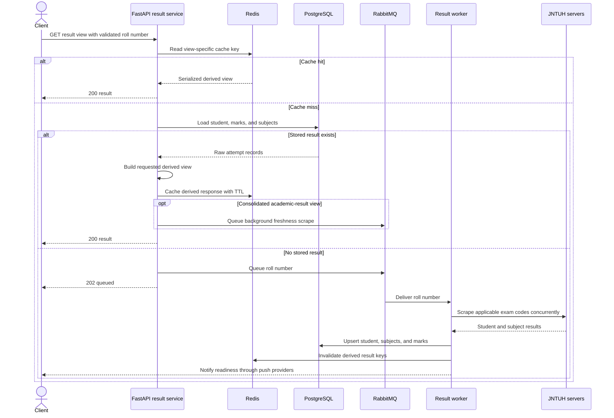

# JNTUH Results BACKEND

<p align="center">
  <a href="https://github.com/ThilakReddyy/jntuh-backend/actions/workflows/deploy.yml"></a>
  <a href="https://github.com/ThilakReddyy/jntuh-backend"></a>
  <a href="https://github.com/ThilakReddyy/jntuh-backend/commits/main"></a>
  <a href="https://github.com/ThilakReddyy/jntuh-backend/blob/main/LICENSE"></a>
  
</p>


This FastAPI-based service provides access to **student results, academic records, and backlog details**. It integrates with **PostgreSQL**, **Redis**, and **RabbitMQ** for efficient data handling and messaging.


[](https://modelcontextprotocol.io/)


##  Features  

✅ **Fetch all results** for a student  
✅ **Retrieve academic records** based on student ID  
✅ **Check backlogs** (pending subjects)  
✅ **Uses Redis caching** for optimized performance  
✅ **RabbitMQ integration** for event-driven messaging  
✅ **Read-only MCP server** for AI assistants and compatible clients\
✅ **Docker support** for easy deployment  


## Tech Stack  

- **Backend**: FastAPI (Python)  
- **Database**: PostgreSQL  
- **Caching**: Redis  
- **Messaging Queue**: RabbitMQ  
- **Containerization**: Docker
- **Monitoring**: Prometheus, Grafana
- **AI Integration**: Model Context Protocol (MCP)

## 🔄 Result Read Path

Result requests use a cache-first, asynchronous-refresh flow:



See [architecture.md](architecture.md) for the architecture diagrams, detailed result lifecycle, queue limits, data model, supporting subsystems, observability, and deployment topology.

## Documentation

| Guide | Purpose |
| --- | --- |
| [Architecture](architecture.md) | Components, result lifecycle, data model, queues, security boundaries, and deployment topology. |
| [Contributing](CONTRIBUTING.md) | Local setup, validation, development rules, and pull request expectations. |
| [Deployment](DEPLOYMENT.md) | Production prerequisites, environment contract, release verification, and rollback. |
| [Security](SECURITY.md) | Vulnerability reporting, security boundaries, secrets, and hardening guidance. |
| [Operations runbook](RUNBOOK.md) | Triage and recovery procedures for result, queue, datastore, provider, and monitoring incidents. |


## Installation & Setup  

1. **Prerequisites**

   Install Python 3.11, Docker, and Docker Compose.

2. **Clone and install dependencies**

   ```bash
   git clone https://github.com/thilakreddyy/jntuh-backend.git
   cd jntuh-backend
   python -m venv venv
   source venv/bin/activate
   python -m pip install -r requirements.txt
   ```

3. **Configure the environment**

   ```bash
   cp .env.example .env
   ```

   Replace the placeholder credentials and endpoints in `.env`.

4. **Start infrastructure and prepare Prisma**

   ```bash
   docker-compose up -d db redis rabbitmq
   prisma generate
   prisma db push
   ```

5. **Run the API and result worker in separate terminals**

   ```bash
   uvicorn main:app --host 0.0.0.0 --port 8000 --reload
   ```

   ```bash
   python main2.py
   ```

The committed Compose file provides infrastructure while its application service remains commented out. See [CONTRIBUTING.md](CONTRIBUTING.md) for full development setup.

## Usage

Once the application is running, access the API documentation at http://localhost:8000/docs. This interactive documentation provides details about each endpoint and allows you to test them directly.

## MCP Tools

The application exposes a read-only [Model Context Protocol (MCP)](https://modelcontextprotocol.io/) server at:

```text
https://jntuhresults.dhethi.com/mcp
```

Open `/connect` for setup instructions, or add the server to an MCP-compatible client:

```json
{
  "mcpServers": {
    "jntuh-results": {
      "url": "https://jntuhresults.dhethi.com/mcp"
    }
  }
}
```

Available tools:

| Tool | Description |
| --- | --- |
| `get_all_result` | Retrieve every exam attempt for a student. |
| `get_academic_result` | Retrieve the consolidated best-attempt academic record. |
| `get_backlogs` | Retrieve pending subjects grouped by semester. |
| `get_credits_checker` | Compare earned and required credits for each academic year. |
| `get_result_contrast` | Compare the results of two students. |
| `check_grace_marks_eligibility` | Check whether grace marks can clear eligible backlogs. |
| `get_class_results` | Retrieve results for an entire class section. |
| `get_notifications` | Retrieve result notifications using filters. |
| `get_latest_notifications` | Retrieve the latest result notifications. |

Only these query operations are exposed; destructive and administrative endpoints are not available through MCP.

## Contributing

Contributions are welcome. See [CONTRIBUTING.md](CONTRIBUTING.md) for setup, validation, development rules, and the pull request checklist.

## License

This project is licensed under the GPL-3.0 .

## Acknowledgements

Special thanks to all contributors and the open-source community for their invaluable support.
