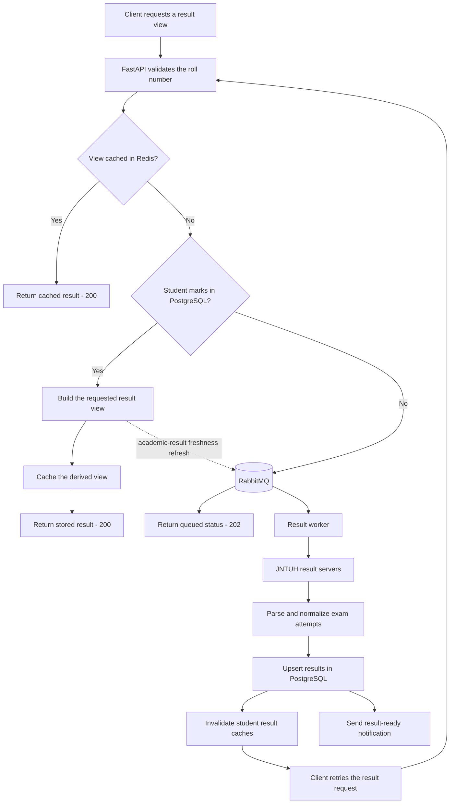

# JNTUH Results BACKEND 

[](https://github.com/ThilakReddyy/jntuh-backend/blob/main/LICENSE)

[](https://jntuhresults.dhethi.com/connect)


This FastAPI-based service provides access to **student results, academic records, and backlog details**. It integrates with **PostgreSQL**, **Redis**, and **RabbitMQ** for efficient data handling and messaging.


[](https://modelcontextprotocol.io/)


##  Features  

✅ **Fetch all results** for a student  
✅ **Retrieve academic records** based on student ID  
✅ **Check backlogs** (pending subjects)  
✅ **Uses Redis caching** for optimized performance  
✅ **RabbitMQ integration** for event-driven messaging  
✅ **Read-only MCP server** for AI assistants and compatible clients\
✅ **Docker support** for easy deployment  


## Tech Stack  

- **Backend**: FastAPI (Python)  
- **Database**: PostgreSQL  
- **Caching**: Redis  
- **Messaging Queue**: RabbitMQ  
- **Containerization**: Docker
- **Monitoring**: Prometheus, Grafana
- **AI Integration**: Model Context Protocol (MCP)

## 🔄 Result Read Path

Result requests use a cache-first, asynchronous-refresh flow:



See [architecture.md](architecture.md) for the architecture diagrams, detailed result lifecycle, queue limits, data model, supporting subsystems, observability, and deployment topology.


## Installation & Setup  

1. **Prerequisites:**

   Ensure you have **Docker** and **Docker Compose** installed.

2. **Clone the repository:**

   ```bash
   git clone https://github.com/thilakreddyy/jntuh-backend.git
   ```
   
3. **Navigate to the project directory:**

   ```bash
   cd jntuh-backend
   ```

4. **Build and start the Docker containers:**

   ```bash
   docker-compose up --build
   ```
   This command will build the Docker images and start the services defined in the docker-compose.yml file.

## Usage

Once the application is running, access the API documentation at http://localhost:8000/docs. This interactive documentation provides details about each endpoint and allows you to test them directly.

## MCP Tools

The application exposes a read-only [Model Context Protocol (MCP)](https://modelcontextprotocol.io/) server at:

```text
https://jntuhresults.dhethi.com/mcp
```

Open `/connect` for setup instructions, or add the server to an MCP-compatible client:

```json
{
  "mcpServers": {
    "jntuh-results": {
      "url": "https://jntuhresults.dhethi.com/mcp"
    }
  }
}
```

Available tools:

| Tool | Description |
| --- | --- |
| `get_all_result` | Retrieve every exam attempt for a student. |
| `get_academic_result` | Retrieve the consolidated best-attempt academic record. |
| `get_backlogs` | Retrieve pending subjects grouped by semester. |
| `get_credits_checker` | Compare earned and required credits for each academic year. |
| `get_result_contrast` | Compare the results of two students. |
| `check_grace_marks_eligibility` | Check whether grace marks can clear eligible backlogs. |
| `get_class_results` | Retrieve results for an entire class section. |
| `get_notifications` | Retrieve result notifications using filters. |
| `get_latest_notifications` | Retrieve the latest result notifications. |

Only these query operations are exposed; destructive and administrative endpoints are not available through MCP.

## Contributing

  Contributions are welcome! Please follow these steps:
  
1. Fork the repository.
2. Create a new branch (git checkout -b feature/YourFeature).
3. Commit your changes (git commit -m 'Add YourFeature').
4.  Push to the branch (git push origin feature/YourFeature).
5.  Open a Pull Request.

## License

This project is licensed under the GPL-3.0 .

## Acknowledgements

Special thanks to all contributors and the open-source community for their invaluable support.
