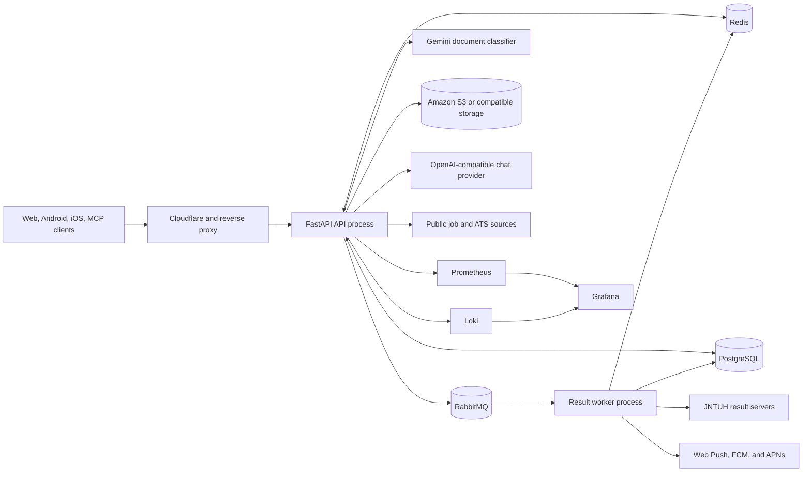
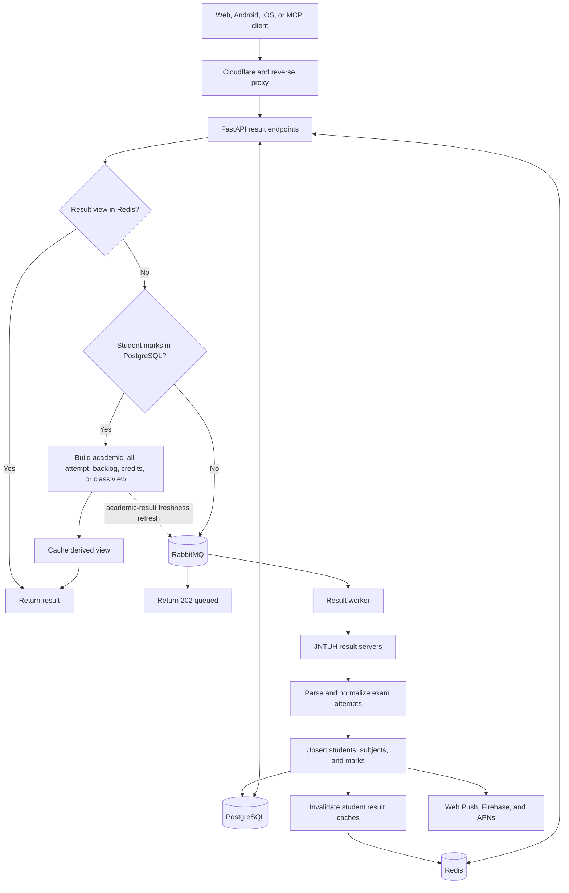
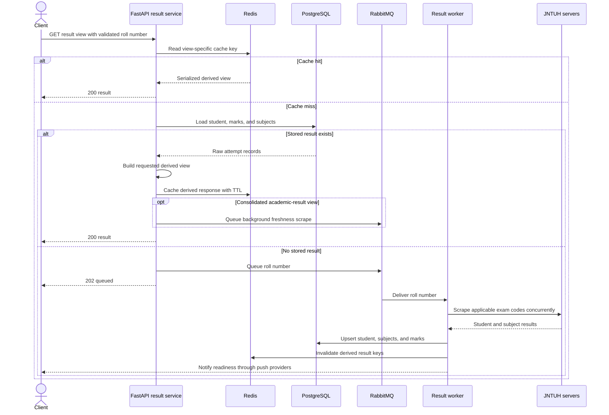

# JNTUH Results Backend Architecture

## Purpose and scope

This repository is primarily a student-results retrieval system for JNTUH. It gives clients a stable API over unreliable upstream result servers by combining a read-through cache, a persistent result store, and asynchronous scraping. The same application also exposes related academic views, result-release notifications, grace-marks workflows, academic content, fresher jobs, and a bounded chatbot.

The implementation is a modular monolith deployed as two cooperating Python processes:

- The FastAPI process in `main.py` accepts HTTP and MCP requests, serves cached or stored results, publishes scrape work, and runs periodic notification and job refresh tasks.
- The RabbitMQ worker in `main2.py` calls `messaging.consumer.consume_messages()`, scrapes JNTUH result servers, writes result records, invalidates caches, and sends result-ready notifications.

Both processes share PostgreSQL, Redis, and RabbitMQ. The `Dockerfile` starts both processes in one application container in the current deployment model, although they are logically independent and can be run separately during development.

## System context

## Runtime components

### API process

`main.py` constructs the FastAPI application and owns its lifespan. On startup it opens a robust RabbitMQ connection, connects Prisma to PostgreSQL, connects the synchronous Redis client, and starts two in-process schedulers:

- Result notifications refresh immediately and then every 60 seconds.
- Jobs refresh immediately and then every 24 hours, guarded by a Redis distributed lock so multiple API workers do not run the same scrape.

The request stack applies CORS, the `X-Api-Key` guard, Redis-backed per-IP rate limiting, request logging, and Prometheus instrumentation. Production mode disables the interactive documentation URLs. `api/routes.py` is the transport layer; route handlers delegate business logic to `service/` modules.

The API also mounts a read-only FastApiMCP application at `/mcp`. MCP operations call the same FastAPI routes through an in-process ASGI client, so their behavior and data sources stay aligned with the HTTP API. Only operations in `config/mcp.py` are exposed. The chatbot uses the same MCP allowlist as tools when calling an optional OpenAI-compatible chat-completions provider.

### Result worker

`main2.py` runs the consumer independently of FastAPI. It creates its own RabbitMQ, Prisma, and Redis connections and consumes two durable queues concurrently:

- `QUEUE_NAME` is the normal per-student scrape queue, with a prefetch count of 2. The special `notificationsi` message triggers a notification refresh instead of a student scrape.
- `CLASS_RESULTS_QUEUE_NAME` is the class batch queue, with a prefetch count of 1. A batch walks the requested and paired admission cohorts, stopping after 20 consecutive empty roll numbers and suppressing another batch for the same class for 24 hours via Redis.

For a student message, the worker finds a reachable JNTUH result host, loads already-known exam codes from PostgreSQL, runs `ResultScraper`, upserts the student/subject/mark data, invalidates the student's derived Redis entries, and sends notifications when new marks were inserted.

### Shared infrastructure

- PostgreSQL is the source of truth. Prisma models students, subjects, immutable exam attempts, result-release metadata, subscriptions/devices, grace-marks proofs, academic content, jobs, and job locations.
- Redis holds derived API responses, the working JNTUH server URL, scheduler locks, class-batch suppression keys, and SlowAPI rate-limit state. Result data remains readable from PostgreSQL if Redis is unavailable, but caching, shared rate limits, and distributed coordination degrade.
- RabbitMQ decouples HTTP latency from slow or unavailable university result servers. Publishers enforce separate normal and class queue thresholds before accepting more work.
- Amazon S3, or an S3-compatible endpoint configured with `S3_ENDPOINT_URL`, stores verified grace-marks proof documents.

## Primary result lifecycle

### Results architecture diagram

### Read path

The principal result endpoints are consolidated academic results, all attempts, backlogs, required credits, result contrast, class results, CMM sample generation, and grace-marks eligibility.

Each result view is derived from the same normalized mark attempts:

| View | Redis key | Behavior |
| --- | --- | --- |
| Consolidated academic result | `<rollNo>Results` | Keeps the best grade per subject and calculates SGPA, CGPA, credits, and backlogs. A database hit also schedules a freshness scrape. |
| Complete attempt history | `<rollNo>ALL` | Groups every regular, supplementary, RCRV, and grace attempt without collapsing attempts. |
| Backlogs | `<rollNo>Backlogs` | Consolidates attempts, then returns subjects whose best grade remains `F` or `Ab`. |
| Required credits | `<rollNo>RequiredCredits` | Compares earned credits with the hard-coded B.Tech regulation and entry-type thresholds. |
| Two-student contrast | `<rollNo1><rollNo2>ResultContrast` | Builds consolidated records for exactly two students and aligns their semester summaries. |
| Class results | `<classPrefix>Results+<type>` | Returns academic, all-attempt, or backlog views for the requested and paired cohorts; cached for 10 minutes. |

The first four student keys expire after 1,200 seconds and are deleted together by `utils.caching.invalidate_all_cache()` after a successful scrape or grace-mark write. Result-contrast and class keys have their own TTLs but are not part of that per-student invalidation helper.

### Scraping and persistence

`scrapers.serverChecker` probes the canonical JNTUH results host and an IP fallback. The selected base URL is cached in Redis under `url`; `.` is the sentinel that both upstreams are unavailable. The normal publisher returns HTTP 424 instead of enqueueing when this sentinel is present.

`ResultScraper` selects request payloads from the roll-number degree pattern and fans out `aiohttp` requests for relevant exam codes. Previously persisted exam codes prevent unnecessary requests. Parsed data is normalized into:

- `student`: one row per unique roll number.
- `subject`: one row per unique subject code.
- `mark`: one row per student, semester, exam, subject, RCRV flag, and grace-marks flag.

The API response models in `database/models.py` transform these raw attempts. Consolidated GPA calculations use the standard grade table or the B.Pharm R22 table selected by `utils.helpers.isbpharmacyr22()`.

### Backpressure and class refresh

The normal queue rejects new work after `RABBITMQ_MAX_MESSAGES` (4,000). A class request first refuses work when the normal queue exceeds `RABBITMQ_CLASS_MAX_MESSAGES` (500), and only schedules a class refresh while the normal queue is below `RABBITMQ_CLASS_PUBLISH_MAX_MESSAGES` (50). The dedicated class queue itself accepts at most `CLASS_RESULTS_QUEUE_MAX_MESSAGES` (3).

The class response is built immediately from matching PostgreSQL records. If records exist and load permits it, a background batch refresh is published. The worker serially probes generated roll numbers across the regular and lateral-entry paired cohorts.

## Result notifications

The API scheduler and the queue sentinel both call `refresh_notifications()`. It scrapes the JNTUH notification listing, parses release metadata, caches the raw notification set for 30 minutes, and upserts new `examcodes` rows. Newly discovered releases are sent to Telegram and broadcast to Android through Firebase Cloud Messaging and to iOS through APNs.

When a student scrape inserts new marks, the worker sends a legacy per-user Web Push message and mobile result-ready notifications to Android/iOS subscriptions associated with that roll number. Grace-marks approval also triggers the mobile result-ready path.

The public notification reads use PostgreSQL with five-minute Redis caches: a filter-specific key for the paginated feed and `latest_notifications` for the last seven days.

## Grace-marks and CMM flows

Grace-marks eligibility requires a B.Tech/B.Pharm roll number, stored 4-2 marks, and at least one remaining backlog. Proof upload repeats that check, limits the upload to PDF/PNG/JPEG and 5 MB, and sends the candidate plus a known reference document to Gemini. Only a confirmed CMM is uploaded to S3 and recorded as a pending `GraceMarksProof` row.

Hidden admin routes protected by `GRACE_MARKS_ADMIN_KEY` list/review proofs, return one-hour presigned download URLs, update review status, and upsert grace-mark attempts. A successful grace-mark write invalidates the main per-student result caches.

The public `/api/getCMM` route is separate: it renders a clearly watermarked sample PDF from the consolidated result response and does not read an uploaded proof.

## Supporting subsystems

- Academic calendars and syllabus are seeded into PostgreSQL and returned as nested trees with one-day Redis caches.
- The jobs scheduler scrapes configured public job/ATS sources, normalizes and upserts fresher jobs and locations, and marks records unseen for 45 days inactive. `/api/jobs` reads active fresher records directly from PostgreSQL.
- `/api/chatbot` runs a bounded tool loop against an OpenAI-compatible provider. Its available tools are the same read-only result/notification operations exposed through MCP; it cannot call hidden admin or mutation routes.

## Security boundaries

- Most HTTP API routes require a non-empty `X-Api-Key`; if `API_ACCESS_KEY` is configured, it must match. MCP, metrics, docs, the root/setup pages, CORS preflights, and recognized mobile User-Agents bypass this middleware.
- SlowAPI defaults to 30 requests/minute per originating IP using Cloudflare and forwarded headers. Redis is the shared store with fail-open in-memory fallback. MCP is exempt; sensitive upload/admin/chat routes define tighter limits.
- MCP has an explicit read-only operation allowlist. Hidden routes are omitted from OpenAPI and MCP, but admin mutations additionally require the admin key.
- Proof objects are accessed through expiring presigned S3 URLs. Credentials and provider keys are environment configuration, not database values.

## Observability

FastAPI exposes Prometheus metrics at `/metrics`; MCP calls receive additional instrumentation. `prometheus.yml` also scrapes RabbitMQ, Redis Exporter, and PostgreSQL Exporter. Application and component loggers write to local files/standard output and push to Loki, and Grafana consumes the monitoring stack.

## Deployment topology

The production workflow runs on pushes to `main`, connects to EC2 over SSH, updates the checkout, rebuilds the application service, and restarts it with Docker Compose. Cloudflare and a reverse proxy sit in front of the application. The image runs `prisma db push`, starts `main2.py` in the background, and runs Uvicorn in the foreground.

The committed Compose configuration defines PostgreSQL, Redis, RabbitMQ, Prometheus, Loki, Grafana, and Redis/PostgreSQL exporters. At the time of this document, its application service is commented out even though the deployment workflow expects an `app` service; an S3-compatible endpoint may be configured, but no MinIO service is present in the committed Compose file.

## Architectural constraints and invariants

- PostgreSQL is authoritative; Redis contains rebuildable views and coordination state.
- HTTP requests do not wait for a cache-and-database miss to finish scraping; they receive `202 Accepted` and poll again after processing.
- The API and worker must use the same queue names, Prisma schema, cache-key conventions, and B.Pharm R22 discriminator.
- Any new per-student cached result view must be added to invalidation logic or be allowed to remain stale until its TTL expires.
- Mark uniqueness must continue to distinguish regular/RCRV/grace attempts while preventing duplicate ingestion of the same attempt.
- Result derivation belongs in model/service code; scraping should persist normalized attempts rather than API-specific response shapes.
- Provider failures should not roll back successfully persisted result or notification data.

## Source map

| Concern | Primary implementation |
| --- | --- |
| Application lifecycle, middleware, MCP, chatbot wiring | `main.py` |
| HTTP routes | `api/routes.py` |
| Result view orchestration | `service/get*Service.py`, `service/getClassResults.py` |
| Queue publishing and consuming | `messaging/publisher.py`, `messaging/consumer.py`, `main2.py` |
| Result and notification scraping | `scrapers/resultScraper.py`, `scrapers/serverChecker.py`, `scrapers/resultNotificationScraper.py` |
| Persistence and response projection | `database/operations.py`, `database/models.py`, `prisma/schema.prisma` |
| Cache invalidation | `utils/caching.py` |
| Push delivery | `subscriptions/` |
| Grace-marks proof workflow | `service/grace_marks_service.py`, `service/cmm_classifier.py`, `utils/s3.py` |
| Jobs | `service/jobsService.py`, `scrapers/jobScraper.py`, `database/jobOperations.py` |
| Runtime/deployment | `Dockerfile`, `docker-compose.yml`, `.github/workflows/deploy.yml` |
